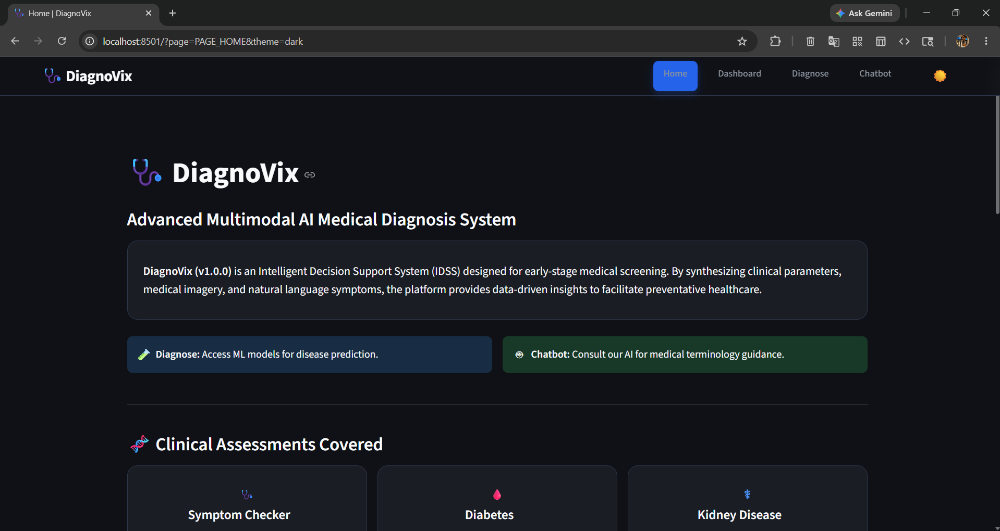
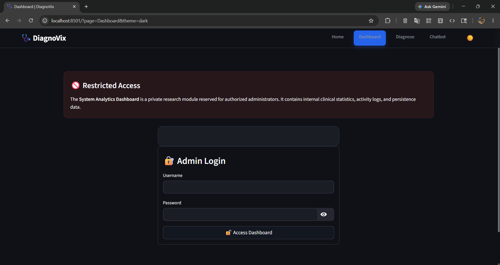
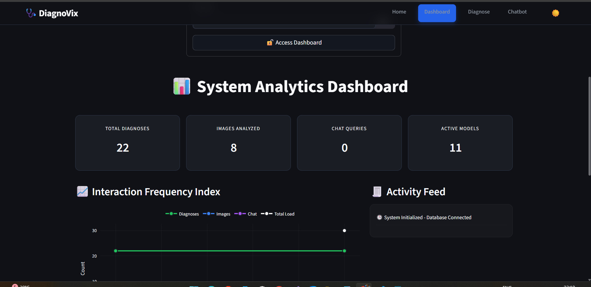
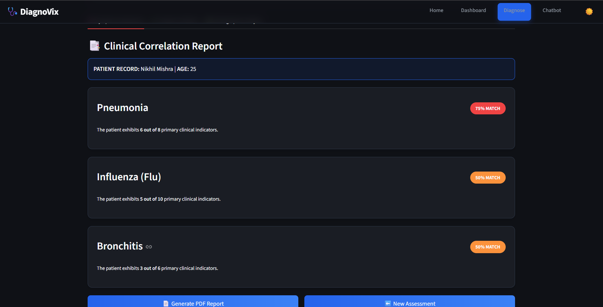
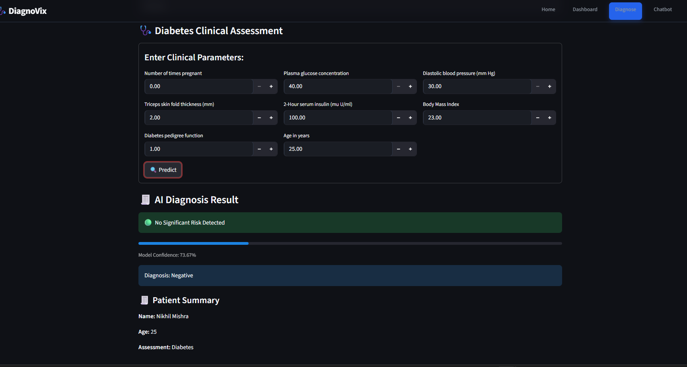
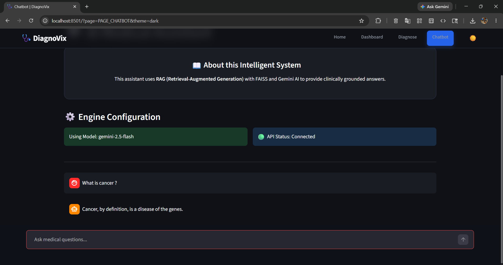
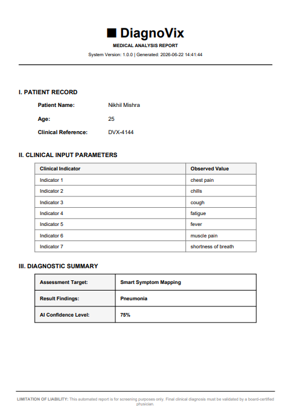
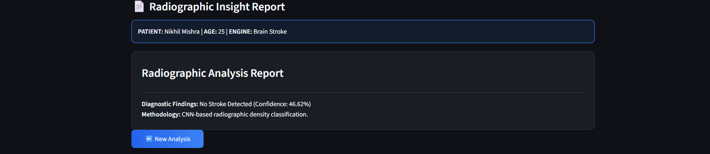

## ✨ Features

### 🔍 Symptom-Based Diagnosis

Analyze user symptoms and generate AI-assisted preliminary diagnostic insights.

### 🤖 Machine Learning Disease Prediction

Predict potential diseases using custom-trained machine learning models with an accuracy of **88%**.

### 💬 Medical Chatbot (RAG-Powered)

Built using **LangChain**, **Google Gemini API**, and **Retrieval-Augmented Generation (RAG)** to:

- Parse medical reports automatically.
- Retrieve relevant medical information.
- Generate context-aware responses.
- Reduce manual review time.

### 🩻 Image-Based Diagnosis

Analyze medical images using deep learning models to assist in disease detection and diagnosis.

---

## 📊 Model Performance

| Module | Performance |
| :--- | :--- |
| Disease Prediction | 88% Accuracy |
| Medical Chatbot | RAG-Based |
| Image-Based Diagnosis | Deep Learning-Based |

---

## 📸 Application Screenshots

### 🏠 Home Page

### ✨ Feature Home Page

### 🔐 Admin Login

### 📊 Dashboard

### 🔍 Symptom Diagnosis

### 📈 Symptom Result

### 🤖 ML-Based Disease Prediction

### 💬 Medical Chatbot

### 📄 Medical Report Analysis

### 🩻 Image Analysis Input

### 🩻 Image Analysis Output

---

